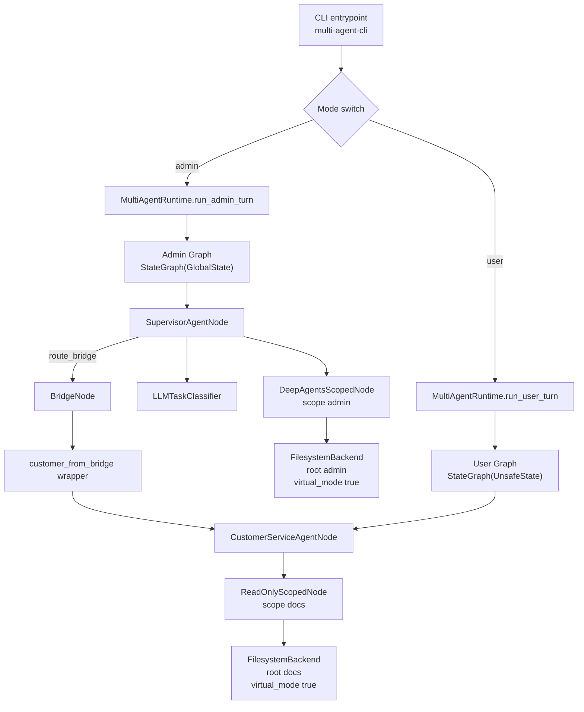
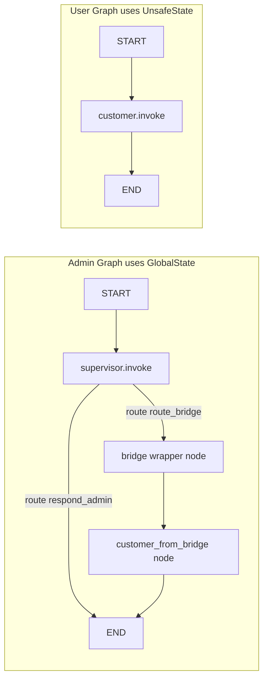
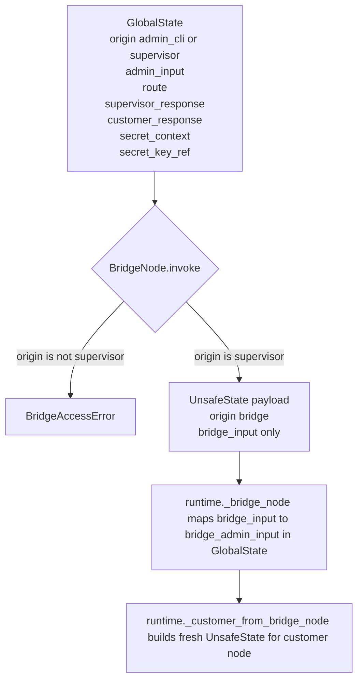
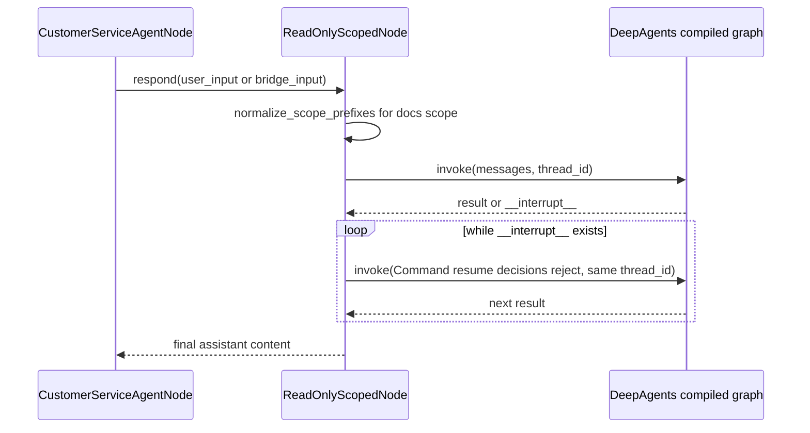
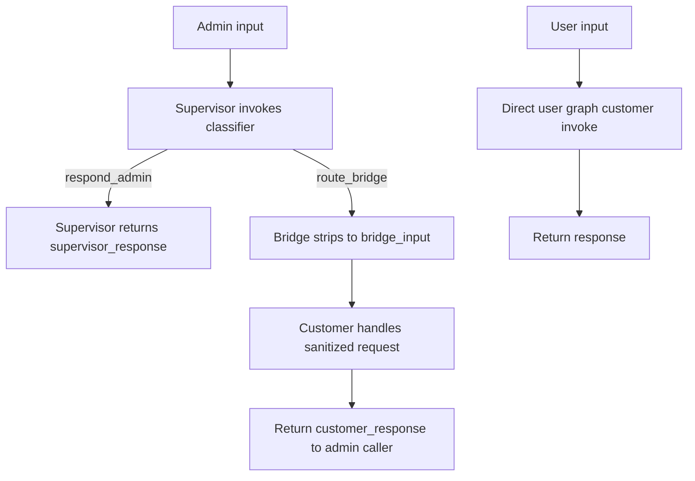

# Flowchart Reference: LangGraph State Architecture and DeepAgents Customization

This reference file maps the runtime flow in the current codebase.

Primary implementation files:
- `src/multi_agent_app/runtime.py`
- `src/multi_agent_app/nodes.py`
- `src/multi_agent_app/states.py`
- `src/multi_agent_app/classifier.py`
- `src/multi_agent_app/models.py`

## 1. Runtime Component Map

## 2. LangGraph State Architectures

## 3. State Boundary Projection

## 4. DeepAgents Customization

```mermaid
flowchart TB
    subgraph SUPP["Supervisor worker path"]
        S1["DeepAgentsScopedNode.create"] --> S2["FilesystemBackend(root admin, virtual_mode true)"]
        S2 --> S3["create_deep_agent with checkpointer false"]
        S3 --> S4["respond() normalizes /admin/... to /... before invoke"]
    end

    subgraph CUSP["Customer worker path"]
        C1["ReadOnlyScopedNode.create"] --> C2["FilesystemBackend(root docs, virtual_mode true)"]
        C2 --> C3["MemorySaver checkpointer"]
        C3 --> C4["create_deep_agent with interrupt_on blocked tools"]
        C4 --> C5["respond() normalizes /docs/... to /... before invoke"]
        C5 --> C6["auto reject loop for interrupts via Command resume decisions reject"]
    end
```

Blocked tools configured in `ReadOnlyScopedNode.BLOCKED_TOOLS`:
- `write_file`
- `edit_file`
- `glob`
- `grep`
- `upload_files`
- `download_files`

## 5. Read-Only Auto-Reject Sequence

## 6. End-to-End Turn Paths

## 7. Key Invariants Captured by the Flow

- Admin and user flows run on separate LangGraph state schemas.
- Bridge accepts only `origin=supervisor`.
- Bridge forwards only `admin_input` as customer-side `bridge_input`.
- Supervisor filesystem scope is `admin` root in virtual mode.
- Customer filesystem scope is `docs` root in virtual mode.
- Customer write and search style tools are interrupted and auto-rejected.
